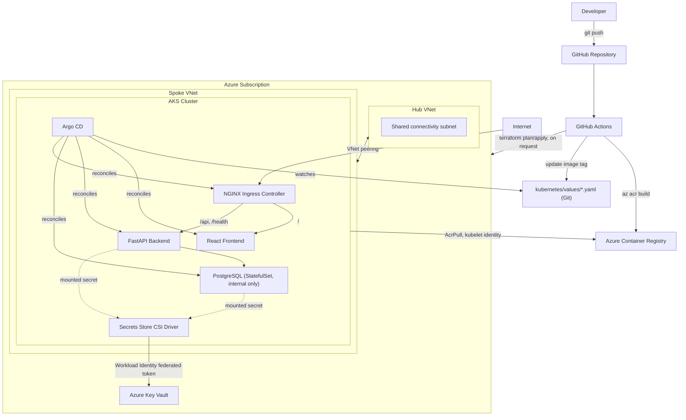

# Architecture

## Overview

This platform is a small, three-tier application (React frontend, FastAPI
backend, PostgreSQL database) deployed to Azure Kubernetes Service, with all
infrastructure defined in Terraform and all application deployment driven by
GitOps through Argo CD.

## Why this architecture

**Hub and spoke networking.** The AKS workload sits in a spoke VNet, peered
to a hub VNet that represents shared connectivity infrastructure (in a real
org: a VPN/ExpressRoute gateway, Azure Firewall, Bastion). This is the
standard Azure landing zone pattern: it isolates workload blast radius in the
spoke while keeping a single place to manage shared network services. For
this portfolio project the hub only contains a placeholder subnet - adding a
firewall or gateway there later doesn't require touching the spoke.

**Separate environment stacks.** `terraform/environments/{dev,staging,prod}`
are independent Terraform root modules, each composing the same modules into
its own resource group, VNet pair, AKS cluster, ACR, and Key Vault. This
gives full blast-radius isolation between environments (a bad `terraform
apply` in dev cannot touch prod) at the cost of running more infrastructure.
See [Cost considerations](../README.md#cost-considerations) for how to avoid
paying for all three simultaneously.

**One AKS cluster hosting three namespaces, by default.** Running the app in
`dev`/`staging`/`prod` *namespaces* on a single cluster (rather than
provisioning `staging`/`prod` AKS clusters for real) is the default
demonstrated path in this repo, purely for cost: a portfolio reviewer should
be able to stand up one cluster and see all three environments, sync
policies, and promotion flow without paying for three clusters. The
Terraform for dedicated staging/prod clusters is real and applyable - if you
provision them, register each with Argo CD (`argocd cluster add`) and change
each environment's Application `destination.server` accordingly.

**Immutable, git-SHA-tagged images.** Every image is tagged
`<run_number>-<git_sha>`, never just `latest`, so a given Argo CD sync always
points at a specific, reproducible build. The tag is surfaced in the
dashboard UI so you can visually confirm what's actually running.

**GitOps via Argo CD, not `kubectl apply` from CI.** GitHub Actions builds
images and pushes ACR, then writes the new image tag into
`kubernetes/values/<env>/*.yaml` and commits. Argo CD - running inside the
cluster - is the only thing that ever talks to the Kubernetes API to apply
changes. This means the deployment credential never leaves the cluster, and
the cluster's actual state is always an explicit function of a Git commit.

**Key Vault + Workload Identity + Secrets Store CSI Driver, not Kubernetes
Secrets in Git.** Database credentials are generated by Terraform
(`random_password`), stored only in Key Vault, and pulled into pods at
runtime via a `SecretProviderClass` using Azure AD Workload Identity - a
federated credential tied to a specific namespace + service account, with no
stored secret or service principal password anywhere.

## Component responsibilities

| Component | Responsibility |
|---|---|
| Terraform | Provisions all Azure infrastructure: resource groups, hub/spoke VNets, AKS, ACR, Key Vault, remote state storage, managed identities |
| ACR | Stores container images, pulled by AKS nodes via the kubelet managed identity (`AcrPull` role, no shared credentials) |
| Key Vault | Stores the database username/password (Terraform-generated), read by pods via the CSI driver |
| AKS | Hosts the application, Argo CD, NGINX ingress, and the Secrets Store CSI Driver (as an AKS-managed add-on) |
| Argo CD | Continuously reconciles cluster state to match the Helm charts + values files in Git |
| NGINX Ingress | Routes `/` to the frontend and `/api`, `/health` to the backend; terminates TLS |
| PostgreSQL | Internal-only (ClusterIP) StatefulSet with a PVC; never has a public IP |

## Request flow

1. Browser requests `https://<host>/` -> ingress -> frontend Service -> frontend pod (static React build served by nginx).
2. Frontend JS calls `/api/items`, `/api/health`, `/health` -> ingress routes these paths to the backend Service -> backend pod.
3. Backend queries PostgreSQL over the internal `postgres.<namespace>.svc.cluster.local:5432` service using credentials mounted from the Secrets Store CSI Driver.
